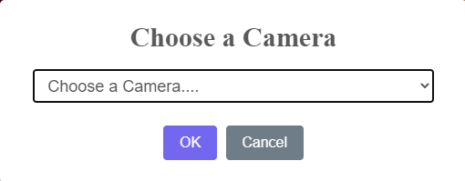

# WebCamTools JS

Created: August 8, 2021 2:20 PM
Last Edited Time: August 8, 2021 5:38 PM

# 安裝

---

下載: [https://github.com/lee98064/WebCamTools/releases](https://github.com/lee98064/WebCamTools/releases)

將JS放在網頁目錄內引用

```html
<script src="./webcamtools.js"></script>
```

# 簡單範例

---

HTML:

```html
<!DOCTYPE html>
<html lang="en">
<head>
    <meta charset="UTF-8">
    <meta http-equiv="X-UA-Compatible" content="IE=edge">
    <meta name="viewport" content="width=device-width, initial-scale=1.0">
    <title>拍照Demo</title>
</head>
<body>
    <video id="webcam" autoplay></video>
    <button type="button" id="takephoto">拍照</button>
    <button type="button" id="changecam">換相機</button>
    </img>
    <script src="./webcamtools.js"></script>
    <script defer>
        //此處填入下方script碼
    </script>
</body>
</html>
```

JS:

```jsx
//建立相機物件
var a = new window.WebCamTools("#webcam");

//按下拍照鈕拍照
document.querySelector('#takephoto').addEventListener('click', function() {

    //呼叫物件內拍照方法，後面網址是拍照後檔案要上傳的網址
    a.takeSnap("./Upload.aspx/MoveImages")
});

//按下按鈕切換相機
document.querySelector('#changecam').addEventListener('click', function() {
    //呼叫切換方法
    setCamera()
});

//獨立出切換相機方法可以重複使用
function setCamera(){
    a.getCameras().then(function (cameras) {
        a.setCamera(cameras);
    }).catch(function (e) {
        console.error(e);
    });
}

//當網頁載入時會跳出選擇相機
setCamera();
```

# 初始化

---

使用new 初始化物件，需傳入要顯示相機畫面的元素ID或Class名稱。

```html
<video id="webcam" autoplay></video>
```

```jsx
var a = new window.WebCamTools("#webcam");
```

# 取得攝影機列表

---

> 如果無法常獲取攝影機列表，請查看頁面底部解決方案。

使用以下方法，可獲得所有連接在電腦上的攝影機

```jsx
a.getCameras().then(function (cameras) {
    //some code here......
}).catch(function (e) {
    console.error(e);
});
```

會回傳以下陣列:

```jsx
[
	攝影機ID: "攝影機名稱"
	1974f768a....: "ManyCam Virtual Webcam"
]
```

# 選擇攝影機

---

將上述獲取的陣列(cameras)傳給以下函數。

```jsx
a.setCamera(cameras);
```

完整如下:

```jsx
a.getCameras().then(function (cameras) {
    a.setCamera(cameras);
}).catch(function (e) {
    console.error(e);
});
```

呼叫後會出現如下畫面:



# 拍照儲存與上傳

---

本套件內含拍照功能，提供儲存與上傳。

## **拍照**

1. 設定一個按鈕

    ```html
    <button type="button" id="takephoto">拍照</button>
    ```

2. 使用JS綁定按鈕事件，並呼叫takeSnap函數

    ```jsx
     a.takeSnap("要上傳到的伺服器網址")
    ```

    ```jsx
    //純JS
    document.querySelector('#takephoto').addEventListener('click', function() {
        //呼叫物件內拍照方法，後面網址是拍照後檔案要上傳的網址
        a.takeSnap("./Upload.aspx/MoveImages")
    });

    //使用Jquery
    $('#takephoto').click(function (e) { 
    		a.takeSnap("./Upload.aspx/MoveImages")
        e.preventDefault();
    });
    ```

3. 拍照完後會出現以下畫面


## 儲存

按下Save按鈕後會自動使用亂數進行命名並下載


## 上傳到伺服器

出現畫面後，按下Upload可以將檔案上傳到您剛剛輸入的伺服器位址，上傳採用Base64並搭配XHR非同步方式上傳。

1. 後端程式碼(採用asp.net Vb進行示範)

    ```vbnet
    Imports System.Web.Services
    Imports System.IO
    Imports System.Data.SqlClient
    Imports System.Data
    Partial Class Upload
        Inherits System.Web.UI.Page
        ' 因為js限制不能使用webform方式上傳，需使用ajax，那回傳過來的是一個json字串，asp會自動將變數對應進imageData
        ' 這部分已經整合進js，所以只需處理asp部分就好
        '回傳樣式:
        ' {
        '     imageData: "BASE64編碼"
        ' }
        '參考網址:https://www.aspforums.net/Threads/102983/Pass-Send-Image-data-as-BASE64-string-using-jQuery-AJAX-in-ASPNet/

        '此句必加，防止引發CSRF或相關登入驗證錯誤

        <WebMethod(EnableSession:=True)>
        Public Shared Sub MoveImages(ByVal imageData As String)
            '檔案名稱須包含副檔名
            Dim fileName As String = DateTime.Now.ToString("yyyy-MM-dd HH-mm-ss") & ".jpeg"
            '儲存路徑，可自行修改，可使用相對路徑或使用那個可以取得當前網頁路徑的那個函數。
            Dim pathstring As String = "D:\"
            Dim destFile As String = Path.Combine(pathstring)
            Dim destFile1 As String = Path.Combine(destFile, fileName)
            '檢查是否有相同檔名，有就刪除舊的，這邊可以客製化作法
            If File.Exists(destFile1) Then
                File.Delete(destFile1)
            End If
            '使用FileStream將Base64轉成圖片檔案
            Using fs As FileStream = New FileStream(destFile1, FileMode.Create)
                Using bw As BinaryWriter = New BinaryWriter(fs)
                    Dim bytes As Byte() = Convert.FromBase64String(imageData)
                    bw.Write(bytes, 0, bytes.Length)
                    bw.Close()
                End Using
            End Using
        End Sub
    End Class
    ```

2. 前端按下按鈕時，會回傳如下JSON格式

    ```jsx
    {
    	imageData: "Base64 Code"
    }
    ```

# 常見問題

---

以下為常見問題，日後如有不足部分會再補足

## 無法獲取攝影機列表

1. 進入網站後，點擊左上角小i後，點選網站設定

    

2. 將權限中攝影機改成允許

    